# Software Requirements Specification (SRS)
## FYP Management System

**Version:** 1.0  
**Date:** November 28, 2025  
**Prepared By:** System Analysis Team  
**Project:** Final Year Project Management System

---

## Table of Contents

1. [Introduction](#1-introduction)
   - 1.1 Purpose
   - 1.2 Scope
   - 1.3 Definitions, Acronyms, and Abbreviations
   - 1.4 References
   - 1.5 Overview
2. [Overall Description](#2-overall-description)
   - 2.1 Product Perspective
   - 2.2 Product Functions
   - 2.3 User Classes and Characteristics
   - 2.4 Operating Environment
   - 2.5 Design and Implementation Constraints
   - 2.6 Assumptions and Dependencies
3. [System Features and Requirements](#3-system-features-and-requirements)
   - 3.1 Functional Requirements
   - 3.2 Non-Functional Requirements
4. [Use Cases](#4-use-cases)
5. [User Stories](#5-user-stories)
6. [System Architecture](#6-system-architecture)
7. [Data Models](#7-data-models)
8. [Interface Requirements](#8-interface-requirements)

---

## 1. Introduction

### 1.1 Purpose

This Software Requirements Specification (SRS) document provides a comprehensive description of the FYP Management System. The document is intended for:
- Development teams implementing the backend system
- Project stakeholders and decision-makers
- Quality assurance teams
- System administrators and maintainers
- End users (students, faculty, coordinators, HOD, evaluators)

The FYP Management System is a web-based platform designed to streamline and automate the management of Final Year Projects in an academic institution. This document specifies the complete functional and non-functional requirements based on the existing user interface implementation.

### 1.2 Scope

The FYP Management System will:

**Included in Scope:**
- Provide role-based access control for five distinct user types (Student, Supervisor, Coordinator, HOD, Evaluator)
- Manage the complete FYP lifecycle from proposal submission to final evaluation
- Automate defense scheduling with conflict detection
- Track student progress through monthly logs and milestone submissions
- Facilitate supervisor-student communication and feedback
- Enable appeals and escalation workflows
- Manage participant payment information for university processing
- Compile and publish results with HOD approval
- Generate analytics and reports for decision-making

**Out of Scope:**
- Integration with existing university LMS (future enhancement)
- Real-time video conferencing for defenses
- Plagiarism detection (will use external tools)
- Financial transaction processing (only information collection)
- Mobile native applications (responsive web design only)

**Benefits:**
- Reduces manual paperwork and administrative overhead by 80%
- Improves transparency in the FYP evaluation process
- Ensures timely submissions through automated notifications
- Provides data-driven insights for resource allocation
- Streamlines payment processing for evaluators and supervisors

### 1.3 Definitions, Acronyms, and Abbreviations

| Term | Definition |
|------|------------|
| **FYP** | Final Year Project - A capstone project undertaken by graduating students |
| **HOD** | Head of Department - Academic administrator overseeing the department |
| **SRS** | Software Requirements Specification |
| **SDS** | Software Design Specification |
| **LMS** | Learning Management System |
| **UI** | User Interface |
| **API** | Application Programming Interface |
| **RBAC** | Role-Based Access Control |
| **CNIC** | Computerized National Identity Card |
| **NTN** | National Tax Number |
| **IBAN** | International Bank Account Number |
| **Proposal** | Initial project plan submitted by students |
| **Defense** | Oral presentation and examination of project work |
| **Interim Defense** | Mid-project evaluation |
| **Final Defense** | End-of-project comprehensive evaluation |
| **Monthly Log** | Progress report submitted by students monthly |
| **Compliance** | Adherence to submission deadlines and requirements |
| **Penalty Points** | Disciplinary points assigned for violations |

### 1.4 References

- [FEATURES.md](FEATURES.md) - Complete feature list
- [FYP_README.md](FYP_README.md) - System overview and tech stack
- [COORDINATOR_GUIDE.md](COORDINATOR_GUIDE.md) - Coordinator features guide
- [QUICK_START.md](QUICK_START.md) - User guide for all roles
- [OPTIMIZATION_SUMMARY.md](OPTIMIZATION_SUMMARY.md) - System optimization details
- IEEE Std 830-1998 - IEEE Recommended Practice for Software Requirements Specifications

### 1.5 Overview

This SRS document is organized into eight main sections:
- **Sections 1-2**: Provide general context, scope, and system overview
- **Section 3**: Details functional and non-functional requirements
- **Section 4**: Describes use cases for all user interactions
- **Section 5**: Contains user stories organized by role
- **Sections 6-8**: Specify architecture, data models, and interface requirements

---

## 2. Overall Description

### 2.1 Product Perspective

The FYP Management System is a **standalone web application** designed to replace manual, paper-based FYP management processes. The system operates as a self-contained platform with the following characteristics:

**System Context:**
- **Frontend**: React 18 + TypeScript single-page application
- **Styling**: Tailwind CSS for responsive design
- **State Management**: React Context API for authentication and global state
- **Routing**: React Router DOM for navigation
- **Backend**: To be implemented (RESTful API recommended)
- **Database**: To be implemented (Relational database recommended)

**System Interfaces:**
- **User Interface**: Web-based responsive interface accessible via modern browsers
- **Email System**: Integration for notifications (future implementation)
- **File Storage**: Document and report upload capabilities
- **Export System**: Excel export for schedules and payment reports

**Hardware Interfaces:**
- Web server for hosting the application
- Database server for data persistence
- File storage server for uploaded documents

**Software Interfaces:**
- Modern web browsers (Chrome, Firefox, Safari, Edge)
- PDF generation library for reports
- Excel export library for data extraction

**Communications Interfaces:**
- HTTPS protocol for secure communication
- RESTful API for client-server communication
- WebSocket for real-time notifications (future enhancement)

### 2.2 Product Functions

The FYP Management System provides the following major functions:

```mermaid
graph TD
    A[FYP Management System] --> B[Authentication & Authorization]
    A --> C[Project Lifecycle Management]
    A --> D[Evaluation & Grading]
    A --> E[Communication & Notifications]
    A --> F[Administration & Reporting]
    
    B --> B1[Role-based Login]
    B --> B2[Session Management]
    
    C --> C1[Proposal Submission & Review]
    C --> C2[Monthly Progress Tracking]
    C --> C3[Document Submissions]
    C --> C4[Defense Scheduling]
    
    D --> D1[Supervisor Evaluations]
    D --> D2[Defense Evaluations]
    D --> D3[Result Compilation]
    D --> D4[Grade Publishing]
    
    E --> E1[Feedback Provision]
    E --> E2[Appeals Management]
    E --> E3[Escalation Handling]
    E --> E4[Announcements]
    
    F --> F1[Penalty Management]
    F --> F2[Payment Processing]
    F --> F3[Analytics Dashboard]
    F --> F4[Report Generation]
```

### 2.3 User Classes and Characteristics

The system supports five distinct user roles, each with specific characteristics and technical expertise:

#### 1. **Student**
- **Description**: Undergraduate/graduate students working on their final year project
- **Frequency of Use**: Daily during project duration (typically 6-8 months)
- **Technical Expertise**: Basic computer literacy, web browser proficiency
- **Primary Functions**:
  - Submit proposals and monthly logs
  - Upload project documents and reports
  - View defense schedules and supervisor feedback
  - Submit appeals when needed
- **Security Level**: Lowest - can only access their own project data
- **Typical Number**: 100-500 concurrent users per semester

#### 2. **Supervisor**
- **Description**: Faculty members guiding and evaluating student projects
- **Frequency of Use**: 3-4 times per week for reviewing student submissions
- **Technical Expertise**: Moderate computer literacy, familiar with academic systems
- **Primary Functions**:
  - Review proposals and monthly logs
  - Provide feedback and ratings
  - Track student progress and compliance
  - Escalate issues to HOD when needed
- **Security Level**: Medium - can access assigned students' data only
- **Typical Number**: 20-50 concurrent users

#### 3. **Coordinator**
- **Description**: Administrative faculty responsible for FYP program management
- **Frequency of Use**: Daily during defense season, weekly otherwise
- **Technical Expertise**: High computer literacy, comfortable with Excel-like interfaces
- **Primary Functions**:
  - Schedule defenses (Excel-like grid interface)
  - Manage room allocations
  - Apply penalties for violations
  - Collect participant payment information
  - Compile results
- **Security Level**: High - can access all student and faculty data
- **Typical Number**: 1-3 concurrent users

#### 4. **HOD (Head of Department)**
- **Description**: Department head with executive oversight
- **Frequency of Use**: 2-3 times per week for approvals and decisions
- **Technical Expertise**: Moderate computer literacy
- **Primary Functions**:
  - Review and decide on student appeals
  - Handle supervisor escalations
  - Approve final results
  - Monitor department analytics
  - Manage supervisor workloads
- **Security Level**: Highest - full access to all department data
- **Typical Number**: 1 user

#### 5. **Evaluator**
- **Description**: Internal or external faculty evaluating student defenses
- **Frequency of Use**: Intensive during defense period (1-2 weeks per semester)
- **Technical Expertise**: Basic to moderate computer literacy
- **Primary Functions**:
  - View assigned defense schedules
  - Access project materials
  - Submit rubric-based evaluations
  - Provide detailed feedback
- **Security Level**: Medium - can access only assigned defenses
- **Typical Number**: 10-30 concurrent users during defense period
- **Evaluator Types**:
  - **Internal Evaluators**: Faculty from the same department
  - **External Evaluators**: Faculty from other departments or institutions

### 2.4 Operating Environment

**Client-Side Requirements:**
- **Operating Systems**: Windows 10+, macOS 10.14+, Linux (Ubuntu 18.04+), iOS 12+, Android 8.0+
- **Web Browsers**:
  - Google Chrome 90+ (Recommended)
  - Mozilla Firefox 88+
  - Safari 14+
  - Microsoft Edge 90+
- **Screen Resolution**: Minimum 1024x768, optimized for 1920x1080
- **Internet Connection**: Broadband (minimum 1 Mbps)

**Server-Side Requirements** (for backend implementation):
- **Web Server**: Node.js 18+ or similar
- **Database**: PostgreSQL 13+ or MySQL 8.0+
- **File Storage**: Minimum 100GB for document storage
- **Operating System**: Linux (Ubuntu 20.04 LTS recommended) or Windows Server 2019+

**Network Requirements:**
- HTTPS support for secure communication
- Firewall configuration for web traffic (ports 80, 443)
- Email server access for notifications

### 2.5 Design and Implementation Constraints

**Technology Constraints:**
- Must use React 18+ with TypeScript for frontend consistency
- Must maintain compatibility with Tailwind CSS design system
- API must follow RESTful principles
- Must support modern ES6+ JavaScript features

**Regulatory Constraints:**
- Must comply with university data privacy policies
- Student records must be stored securely with encryption
- Must maintain audit trails for grade changes and administrative decisions
- GDPR/data protection compliance for personal information

**Performance Constraints:**
- Page load time must not exceed 3 seconds on broadband connection
- System must support 500 concurrent users
- Database queries must complete within 2 seconds
- File uploads must support files up to 50MB

**Security Constraints:**
- All communication must use HTTPS
- Passwords must be hashed using bcrypt or similar
- Session timeout after 30 minutes of inactivity
- Role-based access control must be enforced on all endpoints
- File uploads must be scanned for malware

**Interface Constraints:**
- Must be responsive and work on mobile devices (tablets, smartphones)
- Must follow WCAG 2.1 Level AA accessibility guidelines
- Must support English language (future: multilingual support)

**Business Rules:**
- Students must submit proposals before receiving supervisor
- Monthly logs must be submitted by the 5th of each month
- Defense cannot be scheduled without approved final report
- HOD approval required before publishing results
- Penalty points affect final grades per university policy

### 2.6 Assumptions and Dependencies

**Assumptions:**
- Users have access to modern web browsers and stable internet
- University has existing email infrastructure for notifications
- File storage infrastructure is available
- Academic calendar dates are known in advance
- Grading rubrics and evaluation criteria are predefined
- Payment rates for supervision and evaluation are established

**Dependencies:**
- Availability of React 18, Tailwind CSS, and related libraries
- Database management system (PostgreSQL/MySQL)
- Email service for automated notifications
- File storage service or cloud storage
- SSL certificate for HTTPS
- PDF generation library for reports
- Excel export library for data downloads

**External Dependencies:**
- University authentication system (for future SSO integration)
- Payment processing infrastructure (for information collection only)
- Reliable network connectivity
- Browser compatibility updates

---

## 3. System Features and Requirements

### 3.1 Functional Requirements

This section describes the functional requirements organized by major system features.

#### 3.1.1 Authentication and Authorization

**FR-AUTH-001: User Login**
- **Description**: The system shall provide role-based login capability
- **Priority**: High
- **Inputs**: Email/username, password, role selection
- **Processing**: Validate credentials, create session, redirect to role-specific dashboard
- **Outputs**: Authentication token, user object with role information
- **Pre-conditions**: User account exists in the system
- **Post-conditions**: User is authenticated and session is created

**FR-AUTH-002: Session Management**
- **Description**: The system shall maintain user sessions for authenticated users
- **Priority**: High
- **Duration**: 30 minutes of inactivity before auto-logout
- **Pre-conditions**: User is authenticated
- **Post-conditions**: Session is active and tracked

**FR-AUTH-003: Role-Based Access Control**
- **Description**: The system shall restrict access to features based on user role
- **Priority**: High
- **Roles**: Student, Supervisor, Coordinator, HOD, Evaluator
- **Processing**: Validate user role before allowing access to routes and features
- **Pre-conditions**: User is authenticated
- **Post-conditions**: Access granted only to authorized features

**FR-AUTH-004: Logout**
- **Description**: The system shall allow users to securely logout
- **Priority**: Medium
- **Processing**: Destroy session, clear authentication token, redirect to login
- **Pre-conditions**: User is authenticated
- **Post-conditions**: Session is destroyed, user is logged out

#### 3.1.2 Student Features

**FR-STU-001: View Project Dashboard**
- **Description**: Students shall view their project progress timeline and status
- **Priority**: High
- **Display Elements**:
  - Progress timeline with 5 stages (Proposal, In Progress, Final Report, Defense, Completed)
  - Current progress percentage
  - Proposal status with feedback
  - Supervisor contact information
  - Upcoming defense schedule
  - Recent notifications
- **Pre-conditions**: Student is authenticated
- **Post-conditions**: Dashboard displays current project status

**FR-STU-002: Submit Project Proposal**
- **Description**: Students shall submit project proposals for supervisor review
- **Priority**: High
- **Inputs**: Project title, description, objectives, methodology
- **Validation**: All required fields must be completed
- **Processing**: Submit proposal, notify supervisor
- **Outputs**: Confirmation message, proposal ID
- **Pre-conditions**: Student is enrolled and has not submitted proposal
- **Post-conditions**: Proposal is created with "pending" status

**FR-STU-003: Submit Monthly Logs**
- **Description**: Students shall submit monthly progress logs
- **Priority**: High
- **Inputs**: Month/year, activities performed, progress made, challenges faced
- **Validation**: Cannot submit duplicate logs for same month
- **Processing**: Create log entry, notify supervisor
- **Outputs**: Confirmation message, log ID
- **Pre-conditions**: Student has approved proposal
- **Post-conditions**: Log is created and awaiting supervisor signature

**FR-STU-004: Upload Final Report**
- **Description**: Students shall upload final project report
- **Priority**: High
- **Inputs**: PDF file (max 50MB)
- **Validation**: File format must be PDF, size limit enforced
- **Processing**: Store file, update project stage
- **Outputs**: Upload confirmation, file URL
- **Pre-conditions**: Student has completed required monthly logs
- **Post-conditions**: Final report is uploaded and available for evaluation

**FR-STU-005: View Defense Schedule**
- **Description**: Students shall view their defense schedule details
- **Priority**: High
- **Display Elements**: Date, time, room, evaluator names, defense type
- **Pre-conditions**: Defense has been scheduled by coordinator
- **Post-conditions**: Schedule information is displayed

**FR-STU-006: Submit Appeal**
- **Description**: Students shall submit appeals to HOD
- **Priority**: Medium
- **Inputs**: Appeal type (grade/penalty/supervisor/other), reason, detailed explanation
- **Processing**: Create appeal, notify HOD
- **Outputs**: Appeal ID, confirmation message
- **Pre-conditions**: Student is authenticated
- **Post-conditions**: Appeal is created with "pending" status

**FR-STU-007: View Submission Assignments**
- **Description**: Students shall view and download submission slot requirements
- **Priority**: Medium
- **Display Elements**: Assignment title, description, due date, allowed file types, submission status
- **Pre-conditions**: Student is authenticated
- **Post-conditions**: List of assignments displayed

**FR-STU-008: View Announcements**
- **Description**: Students shall view announcements from coordinators and HOD
- **Priority**: Medium
- **Display Elements**: Announcement title, content, date, attachments
- **Filter**: By date, priority
- **Pre-conditions**: Student is authenticated
- **Post-conditions**: Announcements displayed

#### 3.1.3 Supervisor Features

**FR-SUP-001: View Supervisor Dashboard**
- **Description**: Supervisors shall view overview of all supervisees
- **Priority**: High
- **Display Elements**:
  - Total students count
  - Pending reviews count
  - Approved projects count
  - Active issues count
  - Student list with progress
  - Recent submissions
  - Compliance summary
- **Pre-conditions**: Supervisor is authenticated
- **Post-conditions**: Dashboard displays current supervision status

**FR-SUP-002: Review Project Proposals**
- **Description**: Supervisors shall review and provide feedback on proposals
- **Priority**: High
- **Inputs**: Rating (1-10), feedback text, decision (approve/revision/reject)
- **Processing**: Update proposal status, notify student
- **Outputs**: Updated proposal record
- **Pre-conditions**: Student has submitted proposal
- **Post-conditions**: Proposal status is updated, student receives notification

**FR-SUP-003: Review and Sign Monthly Logs**
- **Description**: Supervisors shall review, rate, and sign monthly logs
- **Priority**: High
- **Inputs**: Rating (1-10), feedback comments, signature approval
- **Processing**: Update log with rating and signature, notify student
- **Outputs**: Signed log record
- **Pre-conditions**: Student has submitted monthly log
- **Post-conditions**: Log is signed and rating is recorded

**FR-SUP-004: View Student Progress**
- **Description**: Supervisors shall view detailed progress of each student
- **Priority**: High
- **Display Elements**: Project title, stage, progress %, compliance status, penalty points
- **Processing**: Display all students with filtering and sorting options
- **Pre-conditions**: Supervisor is authenticated
- **Post-conditions**: Student list displayed with current status

**FR-SUP-005: Escalate Issues to HOD**
- **Description**: Supervisors shall escalate student issues to HOD
- **Priority**: Medium
- **Inputs**: Student selection, issue type, priority (low/medium/high), detailed description
- **Processing**: Create escalation record, notify HOD
- **Outputs**: Escalation ID, confirmation
- **Pre-conditions**: Issue requires HOD intervention
- **Post-conditions**: Escalation is created and pending HOD action

**FR-SUP-006: View Compliance Tracking**
- **Description**: Supervisors shall view student compliance with deadlines
- **Priority**: Medium
- **Display Elements**: On-time submissions, late submissions, missed deadlines
- **Processing**: Calculate compliance metrics per student
- **Pre-conditions**: Supervisor is authenticated
- **Post-conditions**: Compliance data displayed
