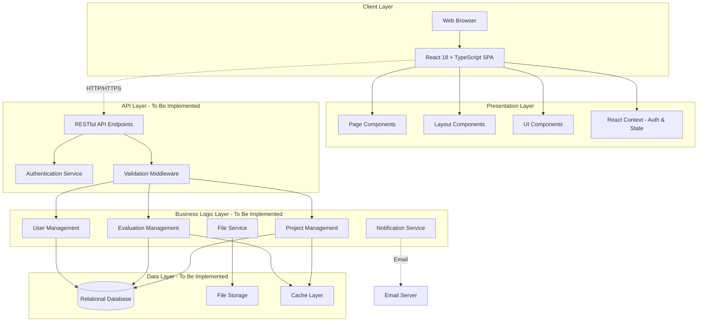

# SRS Document - Part 2
## Continuation of Functional Requirements, Use Cases, and User Stories

---

#### 3.1.4 Coordinator Features

**FR-COORD-001: View Coordinator Dashboard**
- **Description**: Coordinators shall view comprehensive overview of FYP program
- **Priority**: High
- **Display Elements**:
  - Total proposals and approval statistics
  - Scheduled and completed defenses count
  - Overdue submissions count
  - Penalties applied count
  - Proposal status distribution chart
  - Upcoming defenses this week
  - Compliance violation monitoring
- **Pre-conditions**: Coordinator is authenticated
- **Post-conditions**: Dashboard displays current program status

**FR-COORD-002: Schedule Defenses (Excel-like Grid)**
- **Description**: Coordinators shall schedule defenses using Excel-like editable grid
- **Priority**: Critical
- **Display Elements**:
  - Pre-filled student data (group number, students, roll numbers, project title, supervisor)
  - Editable fields: date, time slot, room, internal evaluator, external evaluator
  - Status auto-update when all fields filled
  - Real-time save tracking with unsaved changes indicator
- **Inputs**: Date, time slot selection, room selection, evaluator assignments
- **Validation**: Room conflict checking, evaluator availability
- **Processing**: Update defense schedule, notify all participants
- **Outputs**: Confirmed defense schedule
- **Pre-conditions**: Student has uploaded final report
- **Post-conditions**: Defense is scheduled with all participants notified

**FR-COORD-003: Import/Export Defense Schedule**
- **Description**: Coordinators shall import student data and export final schedules in Excel format
- **Priority**: High
- **Import**: Excel file with student information
- **Export**: Complete defense schedule with all details
- **Pre-conditions**: Coordinator is authenticated
- **Post-conditions**: Data imported or exported successfully

**FR-COORD-004: Manage Participant Payment Information**
- **Description**: Coordinators shall collect and manage payment details for supervisors and evaluators
- **Priority**: High
- **Information Collected**:
  - Personal details (name, email, phone, CNIC)
  - Tax information (NTN number)
  - Banking details (IBAN/account number, bank name)
  - Payment calculation (defense count × rate = total amount)
- **Participant Types**:
  - Supervisors (Rs. 3,000/defense)
  - Internal Evaluators (Rs. 5,000/defense)
  - External Evaluators (Rs. 8,000/defense)
- **Status Tracking**: Verified, Pending, Incomplete
- **Processing**: Validate information completeness, calculate amounts
- **Outputs**: Payment report for finance department
- **Pre-conditions**: Defenses are scheduled
- **Post-conditions**: Payment information collected and verified

**FR-COORD-005: Apply Penalties**
- **Description**: Coordinators shall apply penalties for violations
- **Priority**: Medium
- **Inputs**: Student selection, violation type, penalty points, description
- **Violation Types**: Late submission, missed deadline, policy violation
- **Processing**: Create penalty record, update student compliance status
- **Outputs**: Penalty record, student notification
- **Pre-conditions**: Violation has occurred
- **Post-conditions**: Penalty applied and recorded

**FR-COORD-006: Compile Results**
- **Description**: Coordinators shall compile final results from all evaluations
- **Priority**: High
- **Inputs**: Semester, academic year
- **Processing**: Aggregate scores from proposals, interim, final defenses, supervisor evaluations
- **Calculations**: Weighted score calculation, grade assignment
- **Outputs**: Result compilation report
- **Pre-conditions**: All defenses completed and evaluations submitted
- **Post-conditions**: Results compiled and ready for HOD approval

**FR-COORD-007: View Monthly Logs Record**
- **Description**: Coordinators shall view all student monthly logs with supervisor ratings
- **Priority**: Medium
- **Display Elements**: Student name, month, submission status, supervisor rating, compliance
- **Filter**: By supervisor, by month, by compliance status
- **Pre-conditions**: Coordinator is authenticated
- **Post-conditions**: Monthly logs displayed

**FR-COORD-008: Create Announcements**
- **Description**: Coordinators shall create and publish announcements
- **Priority**: Medium
- **Inputs**: Title, content, priority, target role (all/specific), attachments
- **Processing**: Create announcement, notify target audience
- **Pre-conditions**: Coordinator is authenticated
- **Post-conditions**: Announcement published

#### 3.1.5 HOD (Head of Department) Features

**FR-HOD-001: View HOD Dashboard**
- **Description**: HOD shall view department-level statistics and priorities
- **Priority**: High
- **Display Elements**:
  - Total students and supervisors
  - Pending appeals count
  - Active escalations count
  - Pending result approvals
  - Priority actions panel
  - Recent decisions history
- **Pre-conditions**: HOD is authenticated
- **Post-conditions**: Dashboard displays department overview

**FR-HOD-002: Review and Decide on Appeals**
- **Description**: HOD shall review student appeals and make decisions
- **Priority**: High
- **Inputs**: Decision (approve/reject/request more info), justification/comments
- **Appeal Types**: Grade appeal, penalty appeal, supervisor change, other
- **Processing**: Update appeal status, create decision record, notify student
- **Outputs**: Decision record, notification to student
- **Pre-conditions**: Student has submitted appeal
- **Post-conditions**: Appeal decision recorded, student notified

**FR-HOD-003: Handle Supervisor Escalations**
- **Description**: HOD shall review and resolve escalations from supervisors
- **Priority**: High
- **Inputs**: Action (schedule meeting/issue warning/reassign supervisor), resolution notes
- **Processing**: Update escalation status, take specified action, notify involved parties
- **Outputs**: Resolution record, notifications
- **Pre-conditions**: Supervisor has escalated issue
- **Post-conditions**: Escalation resolved or action initiated

**FR-HOD-004: Approve Results**
- **Description**: HOD shall review and approve compiled results before publishing
- **Priority**: Critical
- **Display Elements**: Student results with all score components, calculated grades
- **Inputs**: Approval decision, comments
- **Processing**: Update result status, enable publishing if approved
- **Outputs**: Approval record
- **Pre-conditions**: Coordinator has compiled results
- **Post-conditions**: Results approved and ready for publishing

**FR-HOD-005: View Analytics**
- **Description**: HOD shall view department analytics including supervisor workloads
- **Priority**: Medium
- **Display Elements**:
  - Supervisor workload (current load vs capacity)
  - Project completion rates
  - Defense success rates
  - Compliance trends
  - Appeal and escalation trends
- **Pre-conditions**: HOD is authenticated
- **Post-conditions**: Analytics displayed

**FR-HOD-006: Publish Results**
- **Description**: HOD shall publish approved results to students
- **Priority**: Critical
- **Processing**: Make results visible to students, generate transcripts
- **Outputs**: Published results, student notifications
- **Pre-conditions**: Results approved by HOD
- **Post-conditions**: Results published and visible to students

**FR-HOD-007: Manage Supervisor Workload**
- **Description**: HOD shall monitor and balance supervisor workloads
- **Priority**: Medium
- **Display Elements**: Supervisor name, current student count, capacity, overload status
- **Actions**: Reassign students, adjust capacities
- **Pre-conditions**: HOD is authenticated
- **Post-conditions**: Workload information displayed

#### 3.1.6 Evaluator Features

**FR-EVAL-001: View Evaluator Dashboard**
- **Description**: Evaluators shall view their assigned defenses and evaluation status
- **Priority**: High
- **Display Elements**:
  - Upcoming defenses count
  - Completed evaluations count
  - Pending evaluations count
  - This week's defense schedule
  - Recent evaluations
- **Pre-conditions**: Evaluator is authenticated
- **Post-conditions**: Dashboard displays evaluation assignments

**FR-EVAL-002: View Defense Schedule**
- **Description**: Evaluators shall view defenses assigned to them
- **Priority**: High
- **Display Elements**: Date, time, room, student names, project title, defense type
- **Filter**: By date, by defense type, by completion status
- **Pre-conditions**: Coordinator has assigned evaluator to defenses
- **Post-conditions**: Defense schedule displayed

**FR-EVAL-003: Access Project Materials**
- **Description**: Evaluators shall download project materials for review
- **Priority**: High
- **Materials**: Proposal, monthly logs, final report, presentation slides
- **Pre-conditions**: Defense is scheduled with evaluator assigned
- **Post-conditions**: Materials downloaded

**FR-EVAL-004: Submit Rubric-Based Evaluation**
- **Description**: Evaluators shall evaluate defenses using weighted rubric
- **Priority**: Critical
- **Evaluation Criteria** (weighted):
  - Technical Implementation (30%)
  - Presentation Skills (25%)
  - Innovation & Creativity (20%)
  - Documentation Quality (15%)
  - Overall Quality (10%)
- **Inputs**: Score for each criterion (0-100), detailed feedback
- **Processing**: Calculate weighted total score (0-100)
- **Validation**: All criteria must be scored
- **Outputs**: Evaluation record with total score
- **Pre-conditions**: Defense has occurred or is in progress
- **Post-conditions**: Evaluation submitted and score calculated

**FR-EVAL-005: View Completed Evaluations**
- **Description**: Evaluators shall view history of their completed evaluations
- **Priority**: Low
- **Display Elements**: Student name, date, defense type, score given, feedback
- **Filter**: By date, by defense type
- **Pre-conditions**: Evaluator has submitted evaluations
- **Post-conditions**: Evaluation history displayed

### 3.2 Non-Functional Requirements

#### 3.2.1 Performance Requirements

**NFR-PERF-001: Response Time**
- Page load time shall not exceed 3 seconds on standard broadband connection (10 Mbps)
- API response time shall not exceed 2 seconds for all queries
- File uploads shall show progress indicator

**NFR-PERF-002: Throughput**
- System shall support 500 concurrent users
- System shall handle 100 concurrent file uploads
- Defense scheduling grid shall render within 1 second for up to 200 student groups

**NFR-PERF-003: Scalability**
- System shall scale to support 1000+ students per semester
- Database shall handle 100,000+ records efficiently
- File storage shall support up to 1TB of documents

#### 3.2.2 Security Requirements

**NFR-SEC-001: Authentication**
- Passwords must be hashed using bcrypt with salt
- Failed login attempts shall be rate-limited (max 5 attempts in 15 minutes)
- Session tokens shall expire after 30 minutes of inactivity

**NFR-SEC-002: Authorization**
- All API endpoints must enforce role-based access control
- Users shall only access data permitted by their role
- Privilege escalation attempts shall be logged and blocked

**NFR-SEC-003: Data Protection**
- All communication must use HTTPS/TLS 1.2+
- Sensitive data (CNIC, NTN, IBAN) must be encrypted at rest
- Personal data must comply with data protection regulations

**NFR-SEC-004: File Security**
- Uploaded files must be scanned for malware
- File types shall be validated before storage
- Maximum file size limit of 50MB enforced

**NFR-SEC-005: Audit Trail**
- System shall log all grade changes with timestamp and user
- Appeal decisions shall be permanently recorded
- Administrative actions shall be auditable

#### 3.2.3 Usability Requirements

**NFR-USE-001: User Interface**
- Interface shall be intuitive and require minimal training
- Common tasks shall be completable in 3 clicks or less
- Error messages shall be clear and actionable

**NFR-USE-002: Accessibility**
- Interface shall comply with WCAG 2.1 Level AA
- Keyboard navigation shall be supported
- Screen reader compatibility required

**NFR-USE-003: Responsive Design**
- Interface shall be responsive on desktop, tablet, and mobile
- Minimum supported resolution: 1024x768
- Touch-friendly interface on mobile devices

**NFR-USE-004: Consistency**
- UI components shall follow consistent design patterns
- Terminology shall be consistent throughout the system
- Color coding shall be used consistently for status indicators

#### 3.2.4 Reliability Requirements

**NFR-REL-001: Availability**
- System shall have 99% uptime during business hours
- Planned maintenance shall be scheduled during low-traffic periods
- Database backups shall be performed daily

**NFR-REL-002: Error Handling**
- System shall handle errors gracefully without crashing
- User-friendly error messages shall be displayed
- Critical errors shall be logged for administrator review

**NFR-REL-003: Data Integrity**
- Database transactions shall maintain ACID properties
- Data validation shall occur on both client and server
- Concurrent edits shall be handled with optimistic locking

#### 3.2.5 Maintainability Requirements

**NFR-MAIN-001: Code Quality**
- Code shall follow TypeScript best practices
- Code coverage shall be minimum 70% for critical features
- Documentation shall be maintained for all APIs

**NFR-MAIN-002: Modularity**
- System shall use component-based architecture
- Backend and frontend shall be loosely coupled via API
- Database schema shall support future extensions

---

## 4. Use Cases

This section provides detailed use case descriptions for major system interactions.

### Use Case 1: Submit and Review Project Proposal

**Use Case ID**: UC-001  
**Use Case Name**: Submit and Review Project Proposal  
**Actors**: Student (Primary), Supervisor (Primary)  
**Goal**: Student submits project proposal and receives supervisor feedback

**Preconditions**:
- Student is enrolled in FYP course
- Student is authenticated in the system
- Supervisor is assigned or will be assigned

**Main Success Scenario**:
1. Student logs into the system
2. Student navigates to Submissions page
3. Student fills proposal form with:
   - Project title
   - Description
   - Objectives
   - Methodology
   - Expected outcomes
4. Student submits proposal
5. System validates all required fields
6. System creates proposal record with "pending" status
7. System notifies assigned supervisor
8. Supervisor logs into system
9. Supervisor views pending proposal in dashboard
10. Supervisor opens review modal
11. Supervisor reviews proposal content
12. Supervisor provides rating (1-10)
13. Supervisor writes detailed feedback
14. Supervisor selects decision: "Approve"
15. System updates proposal status to "approved"
16. System notifies student of approval
17. Student views approved status and feedback

**Alternative Flows**:

**A1: Revision Required**
- At step 14, supervisor selects "Revision Required"
- System updates proposal status to "revision_required"
- System notifies student with feedback
- Student reviews feedback
- Student updates proposal and resubmits
- Flow returns to step 5

**A2: Proposal Rejected**
- At step 14, supervisor selects "Reject"
- System updates proposal status to "rejected"
- System notifies student
- Student must submit new proposal
- Flow returns to step 3

**A3: Missing Required Fields**
- At step 5, validation fails
- System displays error messages for missing fields
- Flow returns to step 3

**Postconditions**:
- Proposal is submitted and status recorded
- Supervisor has reviewed and provided feedback
- Student has been notified of decision

**Special Requirements**:
- Proposal submission form must auto-save drafts
- File attachments (optional) up to 10MB supported

---

### Use Case 2: Schedule Defense Using Excel Grid

**Use Case ID**: UC-002  
**Use Case Name**: Schedule Defense Using Excel-like Grid  
**Actors**: Coordinator (Primary), System (Supporting)  
**Goal**: Coordinator efficiently schedules defenses for all student groups

**Preconditions**:
- Coordinator is authenticated
- Student groups have uploaded final reports
- Evaluators and rooms are available in the system

**Main Success Scenario**:
1. Coordinator logs into system
2. Coordinator navigates to Defense Schedule page
3. System displays Excel-like grid with:
   - Pre-filled student data (group numbers, students, projects, supervisors)
   - Empty editable fields (date, time, room, evaluators)
4. Coordinator clicks on "Date" cell for Group 1
5. System displays date picker
6. Coordinator selects date
7. Coordinator clicks on "Time Slot" cell
8. System displays dropdown with available time slots
9. Coordinator selects time slot
10. Coordinator clicks on "Room" cell
11. System displays dropdown with available rooms
12. System highlights rooms with conflicts in red
13. Coordinator selects available room
14. Coordinator clicks on "Internal Evaluator" cell
15. System displays dropdown of faculty members
16. Coordinator selects internal evaluator
17. Coordinator clicks on "External Evaluator" cell
18. System displays dropdown of external evaluators
19. Coordinator selects external evaluator
20. System auto-updates status to "Complete" for Group 1
21. System shows "unsaved changes" indicator
22. Coordinator repeats steps 4-20 for remaining groups
23. Coordinator clicks "Save Changes" button
24. System validates all data
25. System saves defense schedule
26. System sends notifications to:
    - Students (defense details)
    - Evaluators (assignment confirmation)
    - Supervisors (information copy)
27. System displays success message

**Alternative Flows**:

**A1: Room Conflict Detected**
- At step 12, selected room is occupied at chosen time
- System displays conflict warning
- Coordinator selects different room or time slot
- Flow continues from step 13

**A2: Import Student Data**
- At step 3, coordinator clicks "Import from Excel"
- System displays file upload dialog
- Coordinator selects Excel file
- System parses and imports student data
- System pre-fills grid with imported data
- Flow continues from step 4

**A3: Export Schedule**
- After step 27, coordinator clicks "Export to Excel"
- System generates Excel file with complete schedule
- System downloads file to coordinator's device

**Postconditions**:
- Defenses are scheduled for all groups
- All participants have been notified
- Schedule is saved and exportable

**Special Requirements**:
- Grid must support keyboard navigation (tab, arrow keys)
- Changes must be saved in batch to avoid conflicts
- Real-time conflict detection required

---

### Use Case 3: Evaluate Defense Using Rubric

**Use Case ID**: UC-003  
**Use Case Name**: Evaluate Defense Using Weighted Rubric  
**Actors**: Evaluator (Primary)  
**Goal**: Evaluator submits structured evaluation with weighted scoring

**Preconditions**:
- Evaluator is assigned to defense
- Defense has occurred or is in progress
- Evaluator is authenticated

**Main Success Scenario**:
1. Evaluator logs into system
2. Evaluator navigates to Evaluations page
3. System displays assigned defenses
4. Evaluator clicks "Evaluate" for specific defense
5. System opens evaluation modal with:
   - Student information
   - Project title and materials
   - Rubric with 5 criteria
6. Evaluator reviews project materials
7. Evaluator adjusts "Technical Implementation" slider (0-100)
8. System calculates: score × 30% weight
9. Evaluator adjusts "Presentation Skills" slider (0-100)
10. System calculates: score × 25% weight
11. Evaluator adjusts "Innovation & Creativity" slider (0-100)
12. System calculates: score × 20% weight
13. Evaluator adjusts "Documentation Quality" slider (0-100)
14. System calculates: score × 15% weight
15. Evaluator adjusts "Overall Quality" slider (0-100)
16. System calculates: score × 10% weight
17. System displays weighted total: sum of all weighted scores
18. Evaluator writes detailed feedback in text area
19. Evaluator clicks "Submit Evaluation"
20. System validates all criteria are scored
21. System saves evaluation record
22. System updates defense status to "evaluated"
23. System displays confirmation message
24. System notifies coordinator of completed evaluation

**Alternative Flows**:

**A1: Incomplete Evaluation**
- At step 20, validation fails (missing criteria)
- System displays error: "All criteria must be scored"
- System highlights incomplete criteria
- Flow returns to step 7

**A2: Save Draft**
- At step 18, evaluator clicks "Save Draft"
- System saves partial evaluation
- Evaluator can return later to complete
- Flow ends

**Postconditions**:
- Evaluation is submitted with all criteria scored
- Weighted total is calculated and stored
- Defense status is updated
- Coordinator is notified

**Special Requirements**:
- Real-time weighted score calculation must be visible
- Sliders must support precise scoring (whole numbers 0-100)
- Evaluation can be edited within 24 hours of submission

---

### Use Case 4: Submit and Resolve Student Appeal

**Use Case ID**: UC-004  
**Use Case Name**: Submit and Resolve Student Appeal  
**Actors**: Student (Primary), HOD (Primary)  
**Goal**: Student appeals decision and HOD reviews and decides

**Preconditions**:
- Student is authenticated
- HOD is authenticated
- Appeal-worthy situation exists

**Main Success Scenario**:
1. Student logs into system
2. Student navigates to dashboard
3. Student clicks "Submit Appeal" button
4. System displays appeal form
5. Student selects appeal type:
   - Grade appeal
   - Penalty appeal
   - Supervisor change request
   - Other
6. Student enters reason (one sentence)
7. Student enters detailed explanation
8. Student attaches supporting documents (optional)
9. Student clicks "Submit Appeal"
10. System validates required fields
11. System creates appeal record with "pending" status
12. System notifies HOD
13. System displays confirmation to student
14. HOD logs into system
15. HOD navigates to Appeals page
16. System displays all pending appeals
17. HOD clicks "Review" for student's appeal
18. System displays appeal details modal with:
    - Student information
    - Appeal type and reason
    - Detailed explanation
    - Attachments
19. HOD reads appeal details
20. HOD selects decision: "Approve"
21. HOD writes justification/comments
22. HOD clicks "Submit Decision"
23. System updates appeal status to "approved"
24. System creates decision record with timestamp
25. System notifies student of decision
26. System implements approved change (if applicable)
27. Student views decision notification

**Alternative Flows**:

**A1: Appeal Rejected**
- At step 20, HOD selects "Reject"
- HOD provides rejection reasoning
- System updates appeal to "rejected"
- System notifies student
- No changes implemented

**A2: Request More Information**
- At step 20, HOD selects "Request More Info"
- HOD specifies information needed
- System notifies student
- Student provides additional information
- Appeal returns to "pending" status
- Flow returns to step 16

**A3: Missing Required Fields**
- At step 10, validation fails
- System displays error messages
- Flow returns to step 5

**Postconditions**:
- Appeal is submitted and reviewed
- HOD decision is recorded
- Student is notified of outcome
- Changes implemented if approved

**Special Requirements**:
- Appeal history must be maintained permanently
- Decision rationale must be recorded
- Students can view decision reasoning

---

### Use Case 5: Compile and Publish Results

**Use Case ID**: UC-005  
**Use Case Name**: Compile and Publish Final Results  
**Actors**: Coordinator (Primary), HOD (Primary), System (Supporting)  
**Goal**: Compile evaluations, obtain HOD approval, and publish results

**Preconditions**:
- All defenses completed
- All evaluations submitted
- Coordinator and HOD are authenticated

**Main Success Scenario**:
1. Coordinator logs into system
2. Coordinator navigates to Compile Results page
3. Coordinator selects semester and academic year
4. Coordinator clicks "Compile Results"
5. System aggregates scores from:
   - Proposal defense (if applicable)
   - Interim defense (if applicable)
   - Final defense (multiple evaluators)
   - Supervisor evaluation
   - Monthly log ratings
6. System calculates weighted total for each student
7. System assigns letter grades based on thresholds
8. System applies penalty deductions
9. System displays results preview to coordinator
10. Coordinator reviews for anomalies
11. Coordinator clicks "Submit to HOD"
12. System updates compilation status to "submitted_to_hod"
13. System notifies HOD
14. HOD logs into system
15. HOD navigates to Result Approval page
16. System displays compiled results
17. HOD reviews all student results
18. HOD checks for calculation errors
19. HOD adds comments (optional)
20. HOD clicks "Approve Results"
21. System updates status to "approved"
22. System enables "Publish" button
23. HOD navigates to Publish Results page
24. HOD clicks "Publish Results"
25. System confirms publication action
26. HOD confirms
27. System updates status to "published"
28. System makes results visible to students
29. System sends notification email to all students
30. Students log in and view their final results

**Alternative Flows**:

**A1: HOD Requests Changes**
- At step 20, HOD identifies issues
- HOD clicks "Request Changes"
- HOD specifies corrections needed
- System returns to coordinator
- Coordinator makes corrections
- Flow returns to step 11

**A2: Coordinator Previews Before Submission**
- After step 9, coordinator exports to Excel
- Coordinator performs offline review
- Coordinator imports corrected data
- Flow continues to step 11

**Postconditions**:
- Results are compiled and calculated
- HOD has approved results
- Results are published to students
- All stakeholders notified

**Special Requirements**:
- Calculation formulas must be transparent and auditable
- Export to PDF for official transcripts
- Results cannot be modified after publishing

---

## 5. User Stories

User stories are organized by role and priority (Must Have, Should Have, Could Have).

### 5.1 Student User Stories

#### Must Have (Critical for Basic Functionality)

**US-STU-001**: As a student, I want to submit my project proposal online so that my supervisor can review it electronically without paper forms.

**Acceptance Criteria**:
- Form includes title, description, objectives, methodology fields
- Submission generates confirmation message
- Supervisor receives notification
- I can view submission status

---

**US-STU-002**: As a student, I want to view my project progress timeline so that I can track which milestones I have completed and what remains.

**Acceptance Criteria**:
- Timeline shows 5 stages: Proposal, In Progress, Final Report, Defense, Completed
- Current stage is highlighted
- Progress percentage is displayed
- Upcoming deadlines are visible

---

**US-STU-003**: As a student, I want to submit monthly progress logs so that I can document my work and receive supervisor feedback.

**Acceptance Criteria**:
- Form includes month/year, activities, progress, challenges fields
- Cannot submit duplicate log for same month
- Submission notifies supervisor
- I can view log history with supervisor ratings

---

**US-STU-004**: As a student, I want to upload my final report so that it can be evaluated during my defense.

**Acceptance Criteria**:
- Drag-and-drop PDF upload (max 50MB)
- Upload progress indicator shown
- Confirmation message on successful upload
- File is accessible to evaluators

---

**US-STU-005**: As a student, I want to view my defense schedule so that I know when, where, and who will evaluate my project.

**Acceptance Criteria**:
- Display shows date, time, room number
- Evaluator names are visible
- Defense type (proposal/interim/final) is indicated
- I receive notification when defense is scheduled

#### Should Have (Important but Not Critical)

**US-STU-006**: As a student, I want to view my supervisor's contact information so that I can reach them for guidance.

**Acceptance Criteria**:
- Dashboard shows supervisor name, email, office location
- Office hours are displayed
- Contact card is always accessible

---

**US-STU-007**: As a student, I want to submit appeals so that I can request reconsideration of grades or penalties.

**Acceptance Criteria**:
- Appeal form accepts type, reason, detailed explanation
- Submission generates appeal ID
- I receive notification when HOD makes decision
- I can view appeal status and decision

---

**US-STU-008**: As a student, I want to view announcements so that I stay informed about deadlines and policy changes.

**Acceptance Criteria**:
- Announcements sorted by date (newest first)
- Urgent announcements highlighted
- Can filter by date range
- Can download attachments

#### Could Have (Nice to Have)

**US-STU-009**: As a student, I want to download document templates (SRS, SDS) so that I can follow the required format for submissions.

**Acceptance Criteria**:
- Templates available in Guidelines section
- Multiple file formats (Word, PDF)
- Version number and last updated date shown

---

### 5.2 Supervisor User Stories

#### Must Have

**US-SUP-001**: As a supervisor, I want to view all my supervisees in one dashboard so that I can track their overall progress efficiently.

**Acceptance Criteria**:
- Dashboard shows list of all assigned students
- Each student row shows project title, stage, progress %, compliance status
- Statistics cards show total students, pending reviews, approved projects
- Can sort and filter student list

---

**US-SUP-002**: As a supervisor, I want to review and rate project proposals so that I can approve quality projects or request improvements.

**Acceptance Criteria**:
- Review modal shows full proposal content
- Rating slider (1-10) provided
- Text area for detailed feedback
- Three decision options: Approve, Request Revision, Reject
- Student receives notification after review

---

**US-SUP-003**: As a supervisor, I want to review and sign monthly logs so that I can validate student progress and provide feedback.

**Acceptance Criteria**:
- Can view all pending logs in one list
- Log details show activities, progress, challenges
- Rating slider (1-10) provided
- Feedback text area available
- Digital signature/approval button
- Signed logs visible to student

---

**US-SUP-004**: As a supervisor, I want to track student compliance so that I can identify students falling behind on deadlines.

**Acceptance Criteria**:
- Compliance summary shows on-time vs late submissions
- Color-coded indicators (green/yellow/red)
- Late submission count per student
- Can generate compliance report

#### Should Have

**US-SUP-005**: As a supervisor, I want to escalate serious issues to the HOD so that I can get administrative support when needed.

**Acceptance Criteria**:
- Escalation form requires student, issue type, priority, description
- Three priority levels: Low, Medium, High
- HOD receives immediate notification
- Can track escalation status and resolution

---

**US-SUP-006**: As a supervisor, I want to view pending reviews prioritized by deadline so that I can review time-sensitive submissions first.

**Acceptance Criteria**:
- Pending reviews sorted by deadline (earliest first)
- Overdue items highlighted in red
- Count of pending items shown in badge
- Quick access from dashboard

#### Could Have

**US-SUP-007**: As a supervisor, I want to send messages to my students so that I can communicate updates without email.

**Acceptance Criteria**:
- Message form with subject and body
- Can attach files (max 5MB)
- Student receives in-system notification
- Message history maintained

---

### 5.3 Coordinator User Stories

#### Must Have

**US-COORD-001**: As a coordinator, I want to schedule defenses using an Excel-like grid so that I can efficiently assign dates, times, rooms, and evaluators for all students.

**Acceptance Criteria**:
- Grid pre-filled with student data
- Click cells to edit date, time, room, evaluators
- Dropdowns for room and evaluator selection
- Room conflict detection with visual indicators
- Status auto-updates when row is complete
- Bulk save functionality
- Excel import/export supported

---

**US-COORD-002**: As a coordinator, I want to collect participant payment information so that the finance department can process evaluator and supervisor payments.

**Acceptance Criteria**:
- Form collects CNIC, NTN, IBAN, bank name
- Payment calculation: defense count × rate
- Different rates for supervisors, internal/external evaluators
- Status tracking: Incomplete, Pending, Verified
- Export payment report to Excel
- Can filter by role and payment status

---

**US-COORD-003**: As a coordinator, I want to apply penalties for violations so that I can enforce FYP policies and deadlines.

**Acceptance Criteria**:
- Penalty form requires student, violation type, points, description
- Penalty points tracked per student
- Student receives notification of penalty
- Penalty affects final grade calculation
- Penalty log maintains audit trail

---

**US-COORD-004**: As a coordinator, I want to compile final results so that all evaluation scores are aggregated into final grades.

**Acceptance Criteria**:
- Select semester and academic year
- System aggregates proposal, interim, final defense scores
- Includes supervisor evaluation and monthly log ratings
- Applies penalty deductions
- Calculates weighted total and assigns grades
- Preview before submitting to HOD
- Export results to Excel

#### Should Have

**US-COORD-005**: As a coordinator, I want to view proposal status distribution so that I can see how many proposals are approved, pending, or rejected.

**Acceptance Criteria**:
- Pie/bar chart showing status breakdown
- Counts for each status category
- Can drill down to see student list per status
- Updates in real-time

---

**US-COORD-006**: As a coordinator, I want to view all monthly logs with supervisor ratings so that I can monitor overall student progress.

**Acceptance Criteria**:
- Table shows student, month, submission date, supervisor rating
- Filter by supervisor, month, rating range
- Can identify students with low ratings
- Export to Excel for reporting

---

**US-COORD-007**: As a coordinator, I want to create announcements so that I can inform students and faculty about important dates and policy changes.

**Acceptance Criteria**:
- Form includes title, content, priority, target audience
- Can attach files (PDFs, images)
- Can set expiration date
- Target specific roles or all users
- Preview before publishing

#### Could Have

**US-COORD-008**: As a coordinator, I want to generate comprehensive reports so that I can present FYP program statistics to management.

**Acceptance Criteria**:
- Report includes enrollment, completion rates, grade distribution
- Charts and graphs for visual presentation
- Export to PDF and Excel
- Customizable date range

---

### 5.4 HOD User Stories

#### Must Have

**US-HOD-001**: As a HOD, I want to review and decide on student appeals so that I can ensure fair treatment and resolve disputes.

**Acceptance Criteria**:
- Appeals displayed with student info, type, reason, details
- Three decision options: Approve, Reject, Request More Info
- Justification field required for all decisions
- Decision timestamp recorded
- Student notified of decision
- Appeal history maintained permanently

---

**US-HOD-002**: As a HOD, I want to handle supervisor escalations so that I can resolve issues affecting student-supervisor relationships.

**Acceptance Criteria**:
- Escalations show supervisor, student, issue, priority
- Action options: Schedule Meeting, Issue Warning, Reassign Supervisor
- Resolution notes field required
- Status updates: Pending → Resolved
- Both parties notified of resolution

---

**US-HOD-003**: As a HOD, I want to approve compiled results before publishing so that I can verify accuracy and make final grade decisions.

**Acceptance Criteria**:
- View all student results with score breakdowns
- See calculation formulas and weights
- Can request changes from coordinator
- Approval recorded with timestamp
- Comments field for notes
- Approved results enable publishing

---

**US-HOD-004**: As a HOD, I want to publish approved results so that students can view their final grades.

**Acceptance Criteria**:
- Publish button only enabled after approval
- Confirmation dialog before publishing
- All students notified via email
- Results become visible to students
- Publication timestamp recorded
- Results locked after publishing (no edits)

#### Should Have

**US-HOD-005**: As a HOD, I want to view department analytics so that I can make data-driven decisions about resource allocation.

**Acceptance Criteria**:
- Dashboard shows completion rates, grade distribution
- Supervisor workload visualization
- Appeal and escalation trends
- Defense success rates
- Can filter by semester/year
- Export analytics to PDF

---

**US-HOD-006**: As a HOD, I want to manage supervisor workloads so that I can ensure fair distribution of students.

**Acceptance Criteria**:
- Table shows supervisor, current load, capacity
- Overload status highlighted (red/yellow/green)
- Can reassign students to balance load
- Workload history tracked
- Notifications sent on reassignment

#### Could Have

**US-HOD-007**: As a HOD, I want to view priority actions dashboard so that I can focus on urgent matters requiring my attention.

**Acceptance Criteria**:
- Urgent appeals highlighted
- High-priority escalations shown
- Pending approvals listed
- Sorted by urgency/deadline
- Click to take action directly

---

### 5.5 Evaluator User Stories

#### Must Have

**US-EVAL-001**: As an evaluator, I want to view my assigned defense schedule so that I know when and where I need to evaluate students.

**Acceptance Criteria**:
- Schedule shows date, time, room, student names, project title
- Filter by date range
- Upcoming defenses highlighted
- Can view project materials from schedule
- Receive notification when assigned to new defense

---

**US-EVAL-002**: As an evaluator, I want to access project materials so that I can review student work before the defense.

**Acceptance Criteria**:
- Materials include proposal, monthly logs, final report, slides
- Download links for all documents
- Materials available at least 3 days before defense
- Can view online or download

---

**US-EVAL-003**: As an evaluator, I want to submit rubric-based evaluations so that I can provide structured feedback with weighted scoring.

**Acceptance Criteria**:
- Evaluation modal shows 5 weighted criteria
- Sliders for scoring each criterion (0-100)
- Real-time weighted total calculation displayed
- Feedback text area (minimum 50 characters)
- All criteria must be scored before submission
- Confirmation message on successful submission

#### Should Have

**US-EVAL-004**: As an evaluator, I want to view my completed evaluations so that I can reference past scoring patterns.

**Acceptance Criteria**:
- History shows student, date, scores given, feedback
- Filter by date range
- Search by student name
- Can export evaluation history

#### Could Have

**US-EVAL-005**: As an evaluator, I want to save draft evaluations so that I can complete scoring after the defense.

**Acceptance Criteria**:
- "Save Draft" button in evaluation modal
- Partial scores saved
- Can return later to complete
- Draft indicator shown
- Reminder notification after 24 hours

---

## 6. System Architecture

### 6.1 High-Level Architecture



### 6.2 Component Architecture

**Frontend Components (Implemented)**:
- **Pages** (31 total): Role-specific page components
  - Student: 7 pages (Dashboard, Submissions, Defense Schedule, Assignments, Monthly Logs, Announcements, Guidelines)
  - Supervisor: 6 pages (Dashboard, My Students, Pending Reviews, Monthly Logs, Escalations, Guidelines)
  - Coordinator: 7 pages (Dashboard, Defense Schedule, Participant Payments, Penalties, Compile Results, Monthly Logs, Guidelines)
  - HOD: 7 pages (Dashboard, Appeals, Escalations, Result Approval, Publish Results, Analytics, Guidelines)
  - Evaluator: 4 pages (Dashboard, Defense Schedule, Evaluations, Guidelines)
  
- **UI Components**: Card, Button, Modal, Alert, Badge, Table, StatCard
- **Layout Components**: SidebarLayout, DashboardLayout
- **Shared Components**: GuidelinesPage, DefenseSchedulePage, AnnouncementsPage

**Backend Services (To Be Implemented)**:
- Authentication Service
- User Management Service  
- Project Management Service
- Evaluation Service
- Notification Service
- File Storage Service
- Report Generation Service

---

## 7. Data Models

Key data entities are defined in TypeScript interfaces. Below are the primary entities:

### 7.1 Core Entities

**User**
```typescript
interface User {
  id: string;
  name: string;
  email: string;
  role: 'student' | 'supervisor' | 'coordinator' | 'hod' | 'evaluator';
  evaluatorType?: 'internal' | 'external'; // Only for evaluator role
  avatar?: string;
}
```

**Student**
```typescript
interface Student {
  id: string;
  name: string;
  email: string;
  rollNumber: string;
  supervisorId?: string;
  supervisorName?: string;
  projectTitle?: string;
  proposalStatus: 'pending' | 'approved' | 'revision_required' | 'rejected';
  currentStage: 'proposal' | 'in_progress' | 'final_report' | 'defense' | 'completed';
  progressPercentage: number;
  compliance: 'good' | 'warning' | 'critical';
  penaltyPoints: number;
}
```

**Project**
```typescript
interface Project {
  id: string;
  studentId: string;
  title: string;
  description: string;
  proposalStatus: ProposalStatus;
  stage: ProjectStage;
  supervisorId: string;
  submittedAt: Date;
  approvedAt?: Date;
  feedback?: string;
}
```

**MonthlyLog**
```typescript
interface MonthlyLog {
  id: string;
  studentId: string;
  month: string;
  year: number;
  activities: string;
  progress: string;
  challenges?: string;
  submittedAt: Date;
  supervisorSigned: boolean;
  supervisorFeedback?: string;
  rating?: number; // 1-10
}
```

**Defense**
```typescript
interface Defense {
  id: string;
  studentId: string;
  projectTitle: string;
  type: 'proposal' | 'interim' | 'final';
  date: Date;
  time: string;
  room: string;
  evaluatorIds: string[];
  status: 'scheduled' | 'completed' | 'cancelled';
  score?: number;
}
```

**Evaluation**
```typescript
interface EvaluationCriteria {
  technicalImplementation: number; // 30%
  presentationSkills: number; // 25%
  innovation: number; // 20%
  documentation: number; // 15%
  overallQuality: number; // 10%
}

interface Evaluation {
  id: string;
  defenseId: string;
  evaluatorId: string;
  studentId: string;
  criteria: EvaluationCriteria;
  totalScore: number; // Weighted sum
  feedback: string;
  submittedAt: Date;
}
```

**Appeal**
```typescript
interface Appeal {
  id: string;
  studentId: string;
  type: 'grade' | 'penalty' | 'supervisor' | 'other';
  reason: string;
  details: string;
  submittedAt: Date;
  status: 'pending' | 'approved' | 'rejected';
  hodDecision?: string;
  decidedAt?: Date;
}
```

**ResultCompilation**
```typescript
interface ResultCompilation {
  id: string;
  semester: string;
  academicYear: string;
  compiledBy: string; // Coordinator ID
  compiledAt: Date;
  status: 'draft' | 'submitted_to_hod' | 'approved' | 'published';
  results: StudentResult[];
  hodApprovedBy?: string;
  hodApprovedAt?: Date;
  publishedAt?: Date;
}
```

### 7.2 Database Schema Recommendations

**Users Table**
- id (PK, UUID)
- email (unique, indexed)
- password_hash
- name
- role (enum)
- evaluator_type (nullable)
- created_at, updated_at

**Students Table**
- id (PK, UUID)
- user_id (FK → Users)
- roll_number (unique, indexed)
- supervisor_id (FK → Users)
- proposal_status (enum)
- current_stage (enum)
- progress_percentage
- compliance_status
- penalty_points
- created_at, updated_at

**Projects Table**
- id (PK, UUID)
- student_id (FK → Students)
- title
- description
- proposal_status
- stage
- supervisor_id (FK → Users)
- submitted_at
- approved_at
- feedback

**MonthlyLogs Table**
- id (PK, UUID)
- student_id (FK → Students)
- month, year (composite index)
- activities (text)
- progress (text)
- challenges (text)
- submitted_at
- supervisor_signed (boolean)
- supervisor_feedback
- rating

**Defenses Table**
- id (PK, UUID)
- student_id (FK → Students)
- type (enum)
- date, time
- room_id (FK → Rooms)
- status (enum)
- created_at, updated_at

**DefenseEvaluators Table** (many-to-many)
- defense_id (FK → Defenses)
- evaluator_id (FK → Users)
- evaluator_type

**Evaluations Table**
- id (PK, UUID)
- defense_id (FK → Defenses)
- evaluator_id (FK → Users)
- technical_implementation_score
- presentation_skills_score
- innovation_score
- documentation_score
- overall_quality_score
- total_score (calculated)
- feedback (text)
- submitted_at

---

## 8. Interface Requirements

### 8.1 User Interface

**General UI Requirements**:
- Responsive design supporting desktop (1920x1080), tablet (768x1024), mobile (375x667)
- Consistent navigation with sidebar menu for all roles
- Tailwind CSS styling with consistent color scheme
- Role-specific dashboard landing pages
- Lucide React icons throughout
- Loading skeletons for async operations
- Toast notifications for user actions

**Color Coding Standards**:
- **Status Badges**:
  - Green: Approved, Complete, Verified, Good
  - Yellow: Pending, In Progress, Warning
  - Red: Rejected, Critical, Overdue
  - Blue: Information, Draft
  
- **Compliance Indicators**:
  - Green: Good compliance (≥90% on-time)
  - Yellow: Warning (70-89% on-time)
  - Red: Critical (<70% on-time)

**Typography**:
- Headings: System font stack (sans-serif)
- Body: System font stack
- Monospace: For code/IDs

### 8.2 API Interface (To Be Implemented)

**Base URL**: `https://api.fypmanagement.edu/v1`

**Authentication**:
- Method: JWT Bearer tokens
- Header: `Authorization: Bearer <token>`
- Token expiry: 30 minutes
- Refresh token: 7 days

**Key Endpoint Categories**:

1. **Authentication**: `/auth/login`, `/auth/logout`, `/auth/refresh`
2. **Users**: `/users`, `/users/{id}`, `/users/role/{role}`
3. **Projects**: `/projects`, `/projects/{id}`, `/projects/student/{studentId}`
4. **Monthly Logs**: `/monthly-logs`, `/monthly-logs/{id}`, `/monthly-logs/student/{studentId}`
5. **Defenses**: `/defenses`, `/defenses/{id}`, `/defenses/schedule`
6. **Evaluations**: `/evaluations`, `/evaluations/{id}`, `/evaluations/defense/{defenseId}`
7. **Appeals**: `/appeals`, `/appeals/{id}`, `/appeals/student/{studentId}`
8. **Results**: `/results/compile`, `/results/approve`, `/results/publish`
9. **Files**: `/files/upload`, `/files/download/{id}`

**Response Format**:
```json
{
  "success": true,
  "data": { ... },
  "message": "Operation completed successfully",
  "timestamp": "2025-11-28T01:00:00Z"
}
```

**Error Response Format**:
```json
{
  "success": false,
  "error": {
    "code": "VALIDATION_ERROR",
    "message": "Validation failed",
    "details": [ ... ]
  },
  "timestamp": "2025-11-28T01:00:00Z"
}
```

### 8.3 File Upload Interface

**Supported Operations**:
- Proposal documents (PDF, DOCX)
- Monthly log attachments (PDF, images)
- Final reports (PDF only)
- Presentation slides (PDF, PPTX)
- Appeal supporting documents (PDF, images)

**Constraints**:
- Maximum file size: 50MB
- Allowed types: PDF, DOCX, PPTX, JPG, PNG
- Virus scanning required before storage
- Unique filename generation (UUID-based)

---

## Appendix A: Revision History

| Version | Date | Author | Description |
|---------|------|--------|-------------|
| 1.0 | 2025-11-28 | System Analysis Team | Initial SRS document based on UI implementation |

---

## Appendix B: Approval Signatures

This SRS document requires approval from:

- [ ] Project Coordinator
- [ ] Head of Department
- [ ] Development Team Lead
- [ ] Quality Assurance Lead

---

**End of SRS Document - Part 2**
